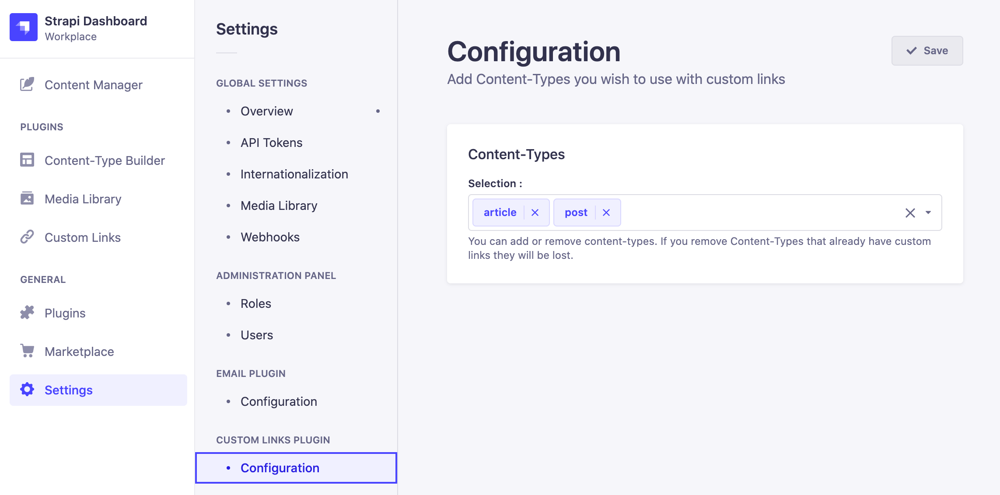
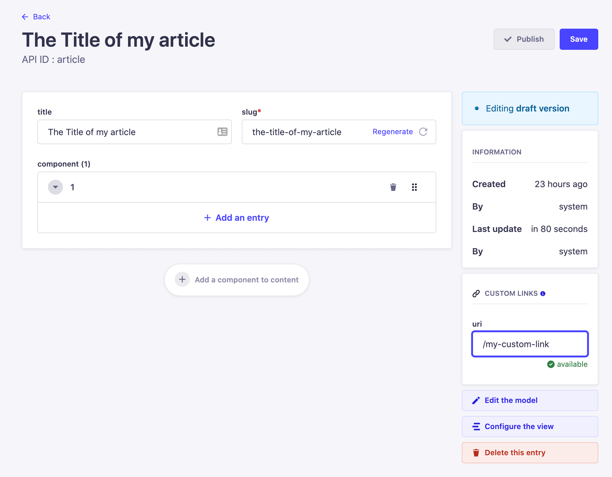
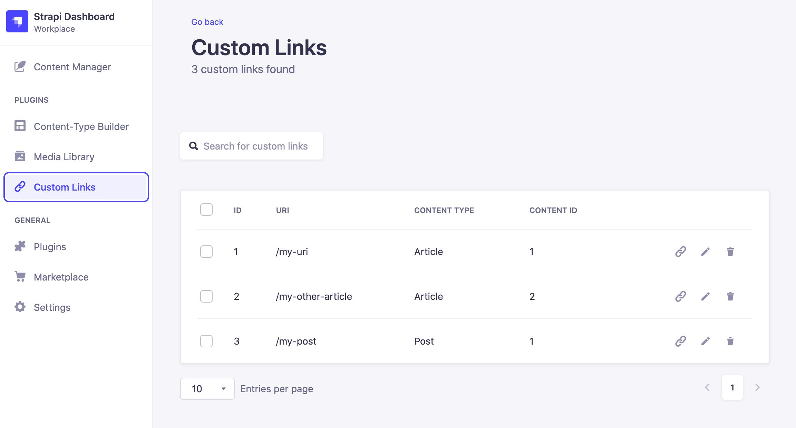

<p align="center">
  
</p>

<div align="center">
  <h1>Strapi v4 - Custom Links</h1>
</div>

A plugin for [Strapi](https://github.com/strapi/strapi) that allows you to create and edit URI for different ContentTypes.

## Installation

```sh
npm install strapi-plugin-custom-links
```

**or**

```sh
yarn add strapi-plugin-custom-links
```

## Configuration

You can configure the plugin directly from the Strapi interface in developer mode.

Go to **Settings > Custom-Links Plugin > Configuration**

And add content-types you wish to associate Custom-Links and just save it.



**_NOTE_**

Alternatively, you can create the config file by your own, by crating a file "custom-links.js" inside the folder config of your strapi project.

The file looks like this :

```javascript
'use strict';

module.exports = {
  contentTypes: ['api::mycontenttype.mycontenttype', 'api::othercontentype.othercontentype'],
};
```

## Usage

### Create / Edit Custom-Links

When editing a Content-Type, you will find at the right section a Custom-Link block, in wich you can create or update a Custom-Link by editing the URI field.



You will be able to retrieve the list of Custom-Links from **Plugins > Custom-Links** section.

In this section you can search, filter, update or delete Custom-Links.



### Request Custom-Links

Custom-Links are available as a Collection, You can fetch them via the url /api/custom-links as you do with your Content-Types.

By requesting a Content-Type with Custom-Link associated you will get the custom-link uri inside the meta of the result.

You can also proxyfie the result of a custom-links uri by using the route /api/custom-links/proxy{/my-uri}. Every relations and compoonents will be poopulated.
